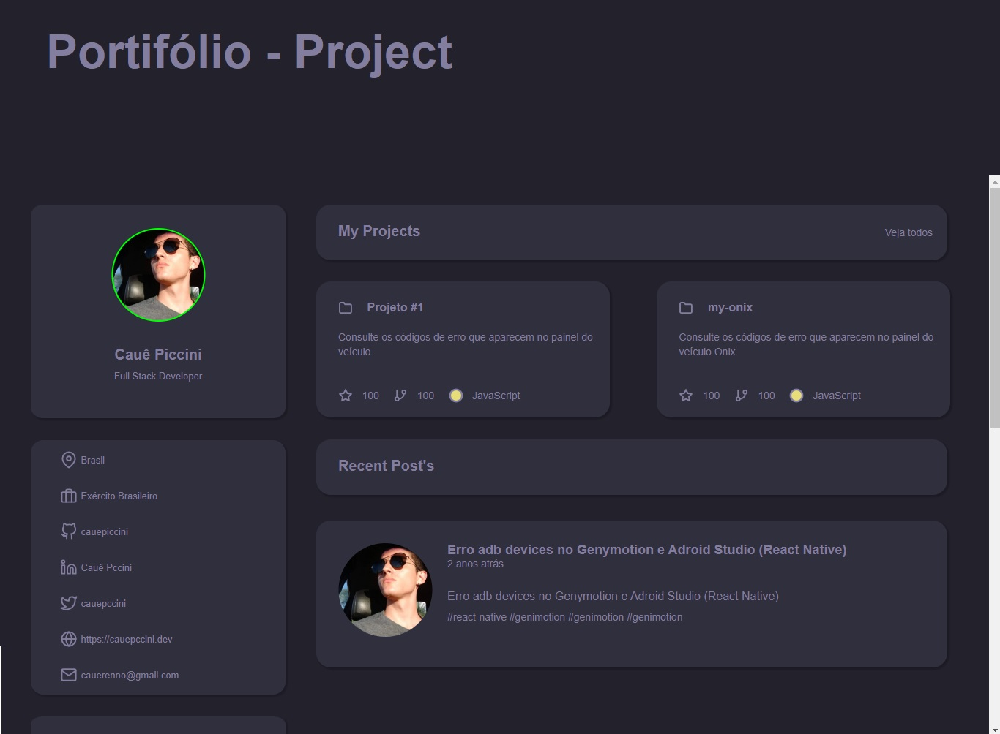

<h1 align="center"> Portifólio </h1>

  <a href="#-tecnologias">Tecnologias</a>&nbsp;&nbsp;&nbsp;|&nbsp;&nbsp;&nbsp;
  <a href="#-projeto">Projeto</a>&nbsp;&nbsp;&nbsp;|&nbsp;&nbsp;&nbsp;
  <a href="#memo-licença">Licença</a>

  

 

  

## 🚀 Tecnologias

Esse projeto foi desenvolvido com as seguintes tecnologias:

- HTML e CSS

## 💻 Projeto

O Portifólio é uma pagina onde pode-se compartilhar seu portifólio de maneria simples e minimalista, deixando assim suas expêriencias, tecnologias de trbalaho e post's com seus projetos online.

## 📝 Licença

Esse projeto está sob a licença MIT.

---"# Portifólio" 
